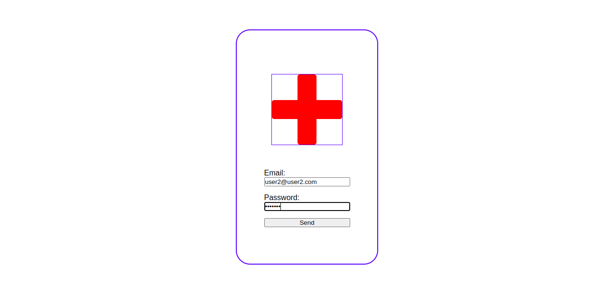
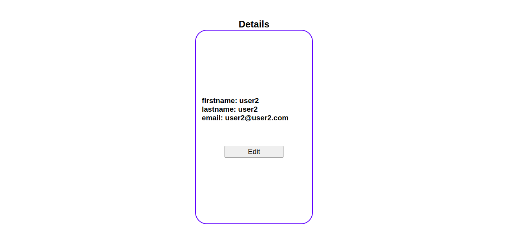
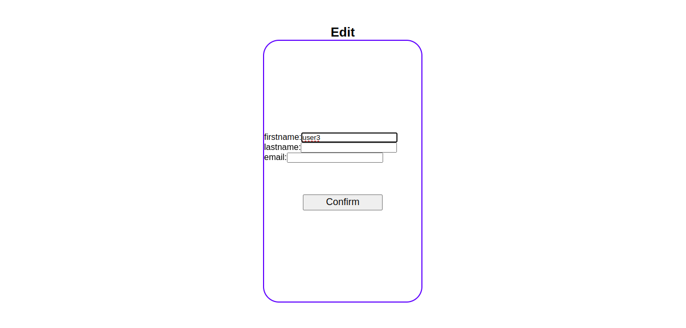

# Sigma Backend Challenge
## Technical challenge for the Sigma Program - Frontend Component

  

  
  
  
    

   
The original challenge was a full-stack project, and considering the independence of its parts, I decided to first separate it into two sub-projects: the <a href="https://github.com/IgorMarinhoArgollo/sigma_backend">backend</a> and the Frontend. The frontend, which will be the focus of the project developed in this repository, essentially consists of a login page, a details (if the user has permission), a editing page (also if the user has permission) and a not found page.

** It's important to note that your request may take longer than expected due to the OnRender (backend host) being on a free plan.

 

  
### :earth_americas: Link
#### <a href="https://sigmafront.netlify.app/" target="_blank">Sigma Front</a>  

### :computer: Used Technologies
  * 
  * 
  * 
  * 
  * 
  * 
  *   

### :gear: How to Run
  #### Requirements:
  * Node
  
  #### Clone the repository (via SSH)
  On terminal:
  
    git clone git@github.com:IgorMarinhoArgollo/sigma_frontend.git
  
  
  #### Installing dependencies:
  On terminal:
  
    npm install

  #### Starting
  On terminal:
  
    npm run dev

   
  
  ## Users for testing
    - user1
     email: user1@user1.com
     password: secret1
     firstname: user1
     lastname: user1

    - user2
     email: user2@user2.com
     password: secret2
     firstname: user2
     lastname: user2

    - user3
     email: user3@user3.com
     password: secret3
     firstname: user3
     lastname: user3
   

  ## Screenshots
  - **Login Page**
  
  
   

   - **View Page**
   

    

   - **Edit Page**
   

     

### :technologist: Author
<a href="https://www.linkedin.com/in/igormarinhoargollo/">
 
  
 <b>Igor Marinho Argollo</b></a> 
    
  